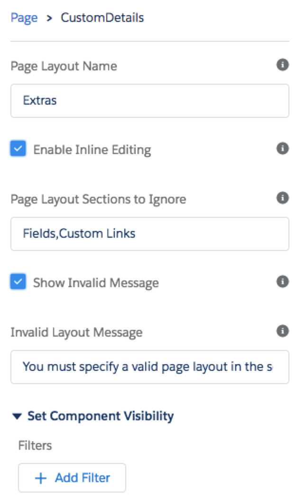

# CustomDetails
A lightning component that can be used to display the custom details from a record using a page layout

## Usage

The component can be used by placing the component in the desired location on the lightning flexipage.


The detail in the sidebar of the Lightning App Builder allows you to specify data on how the component is used



* **Page Layout Name** -- the name of the layout 
* **Enable Inline Editing** -- checkbox to indicate whether or not inline editing (little pencils) should be enabled
* **Page Layout Sections to Ignore** -- a comma-delimited list of section names to NOT display. For example, 'Custom Links' would cause the component to skip that standard section on the page layout.
* **Show Invalid Message** -- checkbox to indicate whether or not a message should be displayed if the specified page layout cannot be found.
* **Invalid Layout Message** -- the message to display if the page layout cannot be found.

## Including in a Wrapper Component
If you need a more complex use case (e.g. displaying related 

```
<apex:component>

// code loading 'parent' component
//

	<c:CustomDetails 
		sObjectName="SomeOtherObject__c" 
		recordId="{!v.otherObject.Id}" 
		layoutName="Special Layout"
		ignoreSections="Details,Custom Links"
		enableInlineEdit="true" />
		
</apex:component>
```


## Known Limitations

To enable editing, the underlying object must have a record type (even if it is the default MASTER record type). Some objects, specifically OpportunityLineItem do not support record types, so edit mode is not supported for them.